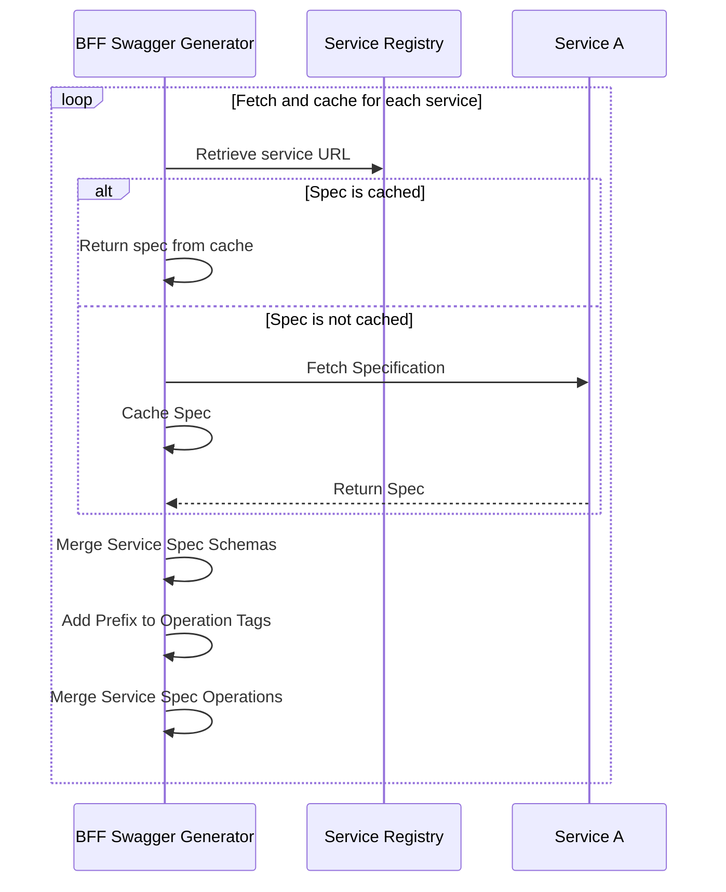

[← Back Home](../README.md)

> ⚠️ **Note:** This service is planned to be renamed to "admin-bff".

## Backend for Frontend (BFF) Overview

- **Technology**: .NET Core
- **Image Name**: link-bff
- **Port**: 8080
- **Database**: NONE
- **Scale**: 0-3

## Related Documentation

See [Admin UI Functionality](../functionality/admin_ui.md) for more information on the role of the BFF service in the Link Cloud ecosystem.

See [BFF](bff.md) for more information on the BFF pattern that is used to support this Admin UI.

## Common Configurations

* [Swagger](../config/csharp.md#swagger)
* [Azure App Configuration](../config/csharp.md#azure-app-config-environment-variables)
* [Service Registry Configuration](../config/csharp.md#service-registry)
* [CORS Configuration](../config/csharp.md#cors)
* [Token Service Configuration](../config/csharp.md#token-service-settings)
* [Service Authentication](../config/csharp.md#service-authentication)

## App Settings

| Name                                     | Value                     | Description                                                                       | Secret? |
|------------------------------------------|---------------------------|-----------------------------------------------------------------------------------|---------|
| SecretManagement__ManagerUri             | \<string>                 | URI to the Azure Key Vault                                                        | Yes     |
| DataProtection__Enabled                  | true or false             | Whether data protection is enabled                                                | No      |
| DataProtection__KeyRing                  | "Link"                    | Pass phrase to encrypt protected data. This should be changed from default value. | Yes     |
| Cache__Enabled                           | true or false             | Whether caching (via Redis) is enabled                                            | No      |
| Cache__Timeout                           | \<number>                 | Cache timeout in minutes                                                          | No      |
| Redis__Password                          | \<string>                 | Redis password                                                                    | Yes     |
| ConnectionStrings__Redis                 | `<RedisConnectionString>` | Connection string for Redis                                                       | Yes     |

## Gateway/Routing

The service is configured via `appsettings.json` to proxy (act as a gateway) for all the underlying micro services, so that the endpoints of the underlying micro services can be exposed to the user interface. This is the reason security _must_ be enabled for all micro services when deployed to a non-development environment.

An example of the YARP configuration is as follows:

```json
{
  "ReverseProxy": {
    "Routes": {
      "route1": {
        "ClusterId": "AccountService",
        "AuthorizationPolicy": "AuthenticatedUser",
        "Match": {
          "Path": "api/account/{**catch-all}"
        }
      }
    },
    "Clusters": {
      "AccountService": {
        "Destinations": {
          "destination1": {
            "Address": ""
          }
        }
      }
    }
  }
}
```

The `Address` property above is left blank as a hint that the actual address should be set at runtime via the deployment's configuration, such as an environment variable `ReverseProxy__Clusters__AccountService__Destinations__destination1_Address` set to the `https://XXX` address that the account service is deployed to.

In the above configuration, if the `AccountService` is deployed to `https://account-service`, and the BFF is deployed to `https://bff.mycompany.com`, then requests to `https://bff.mycompany.com/api/account/**` will be proxied to `https://account-service/**`.

## Swagger Spec Generation

The swagger spec that is generated for the BFF service is a combination of the BFF service's own endpoints and the endpoints of the underlying micro services that the BFF service proxies for. The swagger spec is generated at runtime by the BFF service, and is available at the `/swagger/v1/swagger.json` endpoint.



## API Operations

The **BFF** service provides REST endpoints to support user authentication, session management, and integration testing. These endpoints serve as a bridge between the frontend and backend systems.

### Available REST Operations

#### Authentication and Session Management

- **GET /api/login**: Initiates the login process for Link.
- **GET /api/user**: Retrieves information about the currently logged-in user.
- **GET /api/logout**: Logs out the currently logged-in user.
- **GET /api/auth/token**: Generates a bearer token for the current user to interact with Link services.
- **GET /api/auth/refresh-key**: Refreshes the signing key used for Link bearer tokens.

#### Integration Testing

- **POST /api/integration/patient-event**: Produces a patient event for testing purposes.
- **POST /api/integration/report-scheduled**: Produces a report scheduled event for testing purposes.
- **POST /api/integration/data-acquisition-requested**: Produces a data acquisition requested event for testing purposes.

### Service Information

- **GET /api/info**: Retrieves basic service information for the BFF service.

These operations enable robust session management, integration testing, and backend connectivity for frontend applications.